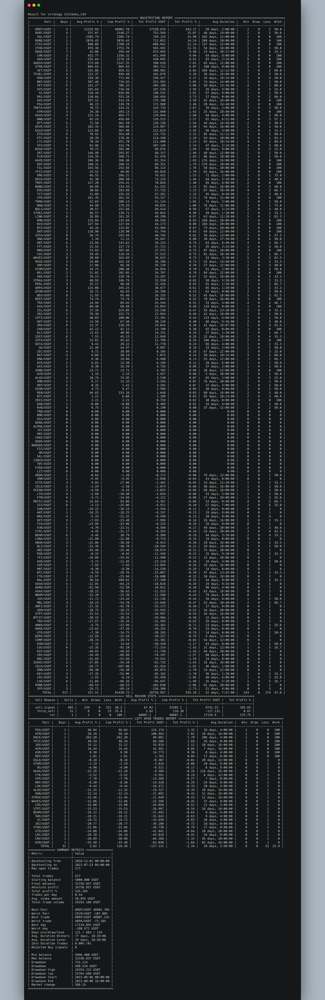

# freq-strategies-Ichimoku
Freqtrade Strategies (Ichimoku)

# Test pairlist

Can be used to generate static pairlists to be used during backtesting / hyperopt.

```bash
freqtrade test-pairlist --config config.json
```

# Download Data

****05/08/2021 - USDT - 4 hours****

```bash
freqtrade download-data --config config_usdt.json --timeframes 4h --days 13
```

****23/07/2021 - USDT - 1 day****

```bash
freqtrade download-data --config config_usdt.json --timeframes 1d --days 13
```

****05/08/2021 - USDT - 1 week****

```bash
freqtrade download-data --config config_usdt.json --timeframes 1w --days 13
```

# Backtesting Strategy List

```bash
freqtrade backtesting --strategy-list Ichimoku_v1 Ichimoku_v2 Ichimoku_v3 Ichimoku_v4 Ichimoku_v5 Ichimoku_v6 Ichimoku_v7 Ichimoku_v8 Ichimoku_v9 Ichimoku_v10 Ichimoku_v11 Ichimoku_v12 Ichimoku_v13 Ichimoku_v14 Ichimoku_v16 Ichimoku_v17 Ichimoku_v18 Ichimoku_v19 Ichimoku_v20 Ichimoku_v21 Ichimoku_v22 Ichimoku_v23 Ichimoku_v24 Ichimoku_v25 Ichimoku_v26 Ichimoku_v27 Ichimoku_v28 Ichimoku_v29 Ichimoku_v30 Ichimoku_v31 Ichimoku_v32 Ichimoku_v33 Ichimoku_v34 --config config_usdt.json --timeframe 4h --timerange=20181201-
```


# Backtesting Ichimoku_v24



# Backtesting Ichimoku_v25


# Update Freqtrade

```bash
./setup.sh -u
```

```bash
git checkout develop
```

```bash
git stash
```

```bash
git pull
```

warning: Pulling without specifying how to reconcile divergent branches is
discouraged. You can squelch this message by running one of the following
commands sometime before your next pull:

  git config pull.rebase false  # merge (the default strategy)
  git config pull.rebase true   # rebase
  git config pull.ff only       # fast-forward only

You can replace "git config" with "git config --global" to set a default
preference for all repositories. You can also pass --rebase, --no-rebase,
or --ff-only on the command line to override the configured default per
invocation.

Updating 5f483acd..729e7733
error: Your local changes to the following files would be overwritten by merge:
        freqtrade/main.py
Please commit your changes or stash them before you merge.
Aborting


