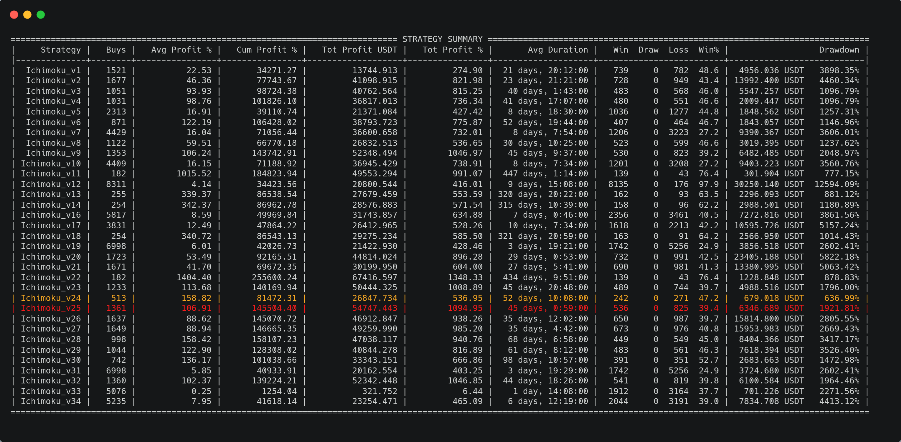

# freq-strategies-Ichimoku
Freqtrade Strategies (Ichimoku)

# Download Data

****23/07/2021 - USDT - 4h****

freqtrade download-data --config config_usdt.json --timeframes 4h --days 13

****23/07/2021 - USDT - 1d****

freqtrade download-data --config config_usdt.json --timeframes 1d --days 13

# Backtesting 

freqtrade backtesting --strategy-list Ichimoku_v1 Ichimoku_v2 Ichimoku_v3 Ichimoku_v4 Ichimoku_v5 Ichimoku_v6 Ichimoku_v7 Ichimoku_v8 Ichimoku_v9 Ichimoku_v10 Ichimoku_v11 Ichimoku_v12 Ichimoku_v13 Ichimoku_v14 Ichimoku_v16 Ichimoku_v17 Ichimoku_v18 Ichimoku_v19 Ichimoku_v20 Ichimoku_v21 Ichimoku_v22 Ichimoku_v23 Ichimoku_v24 Ichimoku_v25 Ichimoku_v26 Ichimoku_v27 Ichimoku_v28 Ichimoku_v29 Ichimoku_v30 Ichimoku_v31 Ichimoku_v32 Ichimoku_v33 Ichimoku_v34 --config config_usdt.json --timeframe 4h --timerange=20181201-

